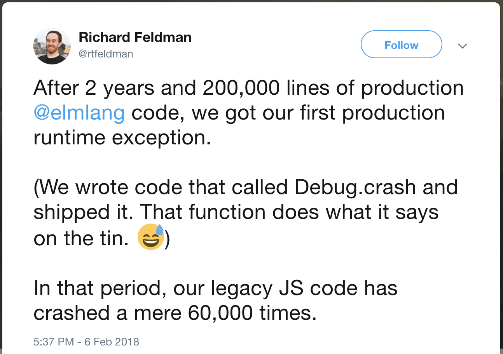
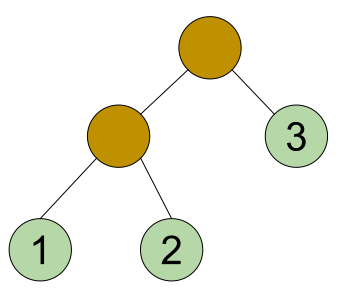
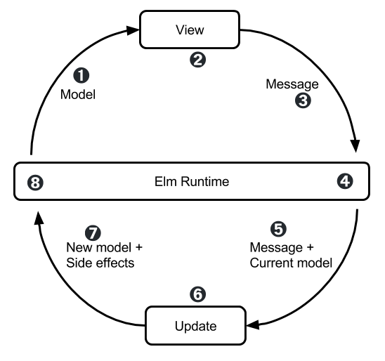

# Elm

## A __delightful__ language for __reliable__ web apps

---

## Delightful

"... one of my primary goals is for Elm to be extraordinarily easy to learn and 
use productively" -- Evan Czaplicki


### Basics

* simple, consistent, concise ML syntax
* compiles to Javascript
* pure functional, all variables are immutable
* statically typed
* type inferencing

### Positive, Welcoming, Helpful Community

* From the Elm Community Code of Conduct
  * Be friendly, welcoming and inclusive.
  * Be helpful and patient.
  * Be respectful and considerate.
  * Avoid negative behaviour.
* elm-lang.slack.com

### Simple, elegant tools
* ellie - Like JSFiddle / Codepen
* elm-format - All Elm code everywhere is formatted the same. 
* Compiler errors for humans
* Time-travelling debugger
* all packages on github
* semantic versioning
* installation
```yaml
npm install -g elm
npm install -g elm-format
npm install -g elm-test
npm install --global elm-live

elm make src/*.elm
elm-live src/Main.elm --open -- --debug
```

### When it compiles, it works
---

## Reliable

### No runtime exceptions!



### Algebraic Data Type

Simple example

```elm
type Tree 
  = Leaf Int
  | Node Tree Tree

-- note the recursive definition
```


```elm
exampleTree = 
    Node 
        Node (Leaf "1") (Leaf "2")
        Leaf "3"

```

Pattern matching

```elm
depthOfTree : Tree -> Int
depthOfTree tree =
    case tree of 
        Leaf _ -> 
            1

        Tree right left ->
            1 + max (depthOfTree left) (depthOfTree right)
```

Parameterized type

```elm
type Tree a 
  = Leaf a
  | Node (Tree a) (Tree a)
```

How is ADT useful?

```elm
full = [ "bunch", "of", "strings"]
empty = []

getFirstElement : List String -> String
getFirstElement list = 
    List.head list
```
Maybe

```elm
type Maybe a = Just a | Nothing
```

Maybe example
```elm

getFirstElement : List String -> Maybe String
getFirstElement list = 
    List.head list


getFirstElement_ : List String -> String
getFirstElement_ list =
    case List.head list of 
        Nothing ->
            "default value"
        Just x ->
            x
```

Result

```elm
type Result error value
    = Ok value
    | Err error

    
takeHttpResult : Result -> Model -> Model
takeHttpResult result model =
      case result of
        Ok fullText ->
          updateModel model fullText

        Err errorCode ->
          showError model errorCode
```

## Make impossible states impossible

"Making Impossible States Impossible" by Richard Feldman - https://www.youtube.com/watch?v=IcgmSRJHu_8      

## Piping

```elm

weirdReversal1 string =
  String.filter isNotSpace (String.toUpper (String.reverse string))

weirdReversal2 string =
  string
    |> String.reverse
    |> String.toUpper
    |> String.filter isNotSpace
```

Handling errors in pipes

```elm
type alias Friend 
  { name : String 
  , friends : List Friend
  }

firstFriend : List Friends -> Maybe String
firstFriend list =
  list
    |> List.head
    |> Maybe.map .friends
    |> Maybe.andThen List.head
    |> Maybe.map .name
    |> Maybe.map String.toUpper
```

Railway Oriented Programming — error handling in functional languages - https://vimeo.com/97344498 - Scott Wlaschin

## The Elm Architecture



Image by Sebastian Porto https://github.com/sporto/elm-workshop (Creative Commons)

## Simple example

https://ellie-app.com/3Z97Y4VvSfRa1

## Interacting with Javascript

Communication with Javascript is through asynchronous ports

https://ellie-app.com/3Z9dKFRMyNDa1

## Other cool things

Time-traveling debugger

It's very fast because of the virtual DOM

Very helpful community

## Disadvantages

Can only communicate with Javascript asynchronously

You can't do everything in Elm (yet) 

Still changing

## Alternatives

* Typed, Functional, Pure
  * Purescript
  * ghcjs (Haskell)
* Typed, Functional
  * Reason 
* Typed
  * Typescript
  * Flow
