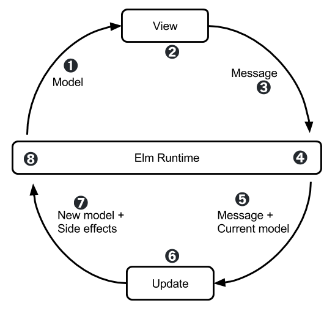

# Elm

## A delightful language for reliable web apps

---

## Delightful

### Evan Czaplicki -- "one of my primary goals is for Elm to be extraordinarily easy to learn and use productively"


### Elm Community

From the Elm Community Code of Conduct

* Be friendly, welcoming and inclusive.
* Be helpful and patient.
* Be respectful and considerate.
* Avoid negative behaviour.

elm-lang.slack.com

### simple, consistent syntax

### simplicity of tools

```yaml
npm install -g elm
npm install -g elm-format
npm install -g elm-test
npm install --global elm-live
```
### elm-format

All Elm code everywhere is formatted the same. 

### ellie

Like JSFiddle / Codepen

### Compiler error for humans

### Time-travelling debugger

### semantic versioning

### type inferencing

### package publishing  

* on github
* minimum requirements make packages useful to others
* read me file length

---

## Reliable

### Elm is a pure functional language

* All variables are immutable

### No runtime exceptions!


### Algebraic Data Type

Simple example

```elm
type Tree = Leaf Int
          | Node Tree Tree

-- note it can be recursively defined
```


```elm
exampleTree = 
    Node 
        Node (Leaf "1") (Leaf "2")
        Leaf "3"

```

Pattern matching

```elm
depthOfTree : Tree -> Int
depthOfTree tree =
    case tree of 
        Leaf n -> 
            1
        Tree right left ->
            1 + max (depthOfTree left) (depthOfTree right)
```

Parameterized type

```elm
type Tree a = Leaf a
          | Node Tree Tree
```

Maybe

```elm
type Maybe a = Just a | Nothing
```

What does List.head return?

```elm
full = [ "bunch", "of", "strings"]
empty = []

exampleFun : List String -> String
exampleFun list = 
    List.head list
```

Maybe
```elm

example1 : List String -> Maybe String
example1 list = 
    List.head list


example2 : List String -> String
example2 list =
    case List.head list of 
        Nothing ->
            "default value"
        Just x ->
            x
```

Result

```elm
type Result error value
    = Ok value
    | Err error

    
takeHttpResult : Result -> Model -> Model
takeHttpResult result model =
      case result of
        Ok fullText ->
          updateModel model fullText

        Err errorCode ->
          showError model errorCode
```

## make impossible impossible

"Making Impossible States Impossible" by Richard Feldman - https://www.youtube.com/watch?v=IcgmSRJHu_8      

## The Elm Architecture



Image by Sebastian Porto https://github.com/sporto/elm-workshop (Creative Commons)

## Simple example

https://ellie-app.com/3Z97Y4VvSfRa1

## Interacting with Javascript

Communication with Javascript is through asynchronous ports

https://ellie-app.com/3Z9dKFRMyNDa1

## Piping

```elm

weirdReversal1 string =
  String.filter isNotSpace (String.toUpper (String.reverse string))

weirdReversal2 string =
string
  |> String.reverse
  |> String.toUpper
  |> String.filter isNotSpace


type alias Friend 
  { name : String 
  , friends : List Friend
  }

firstFriend : List Friends -> Maybe String
firstFriend list =
  list
    |> List.head
    |> Maybe.map .friends
    |> Maybe.andThen List.head
    |> Maybe.map .name
    |> Maybe.map String.toUpper

{-| return a list of Colors of the size of a game grid
-}
buildGrid : Int -> Int -> Int -> Int -> Grid
buildGrid rows columns numColors seedInt =
    listOfSeeds (rows * columns) (initialSeed seedInt)
        |> map (\x -> Random.step (int 0 (numColors - 1)) x)
        |> map Tuple.first
        |> subdivide rows
```

Scott Wlaschin - Railway Oriented Programming — error handling in functional languages - https://vimeo.com/97344498

## Other cool things

Time-traveling debugger

It's very fast because of the virtual DOM

Very helpful community

## Disadvantages

Can only communicate with Javascript asynchronously

You can't do everything in Elm (yet) 

Still changing

## Alternatives (Functional, typed)

Reason 

Purescript

ghcjs (Haskell)
